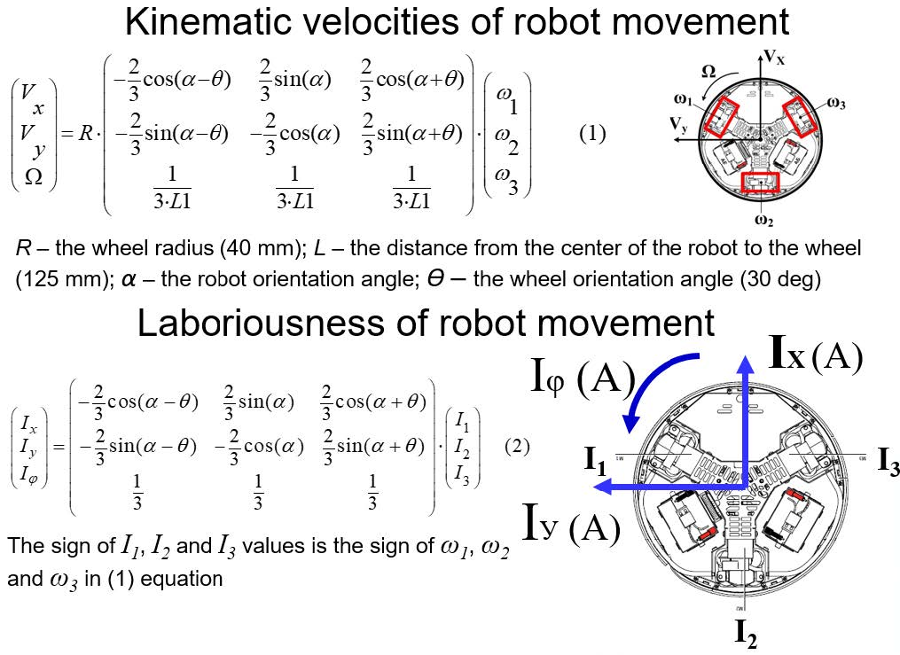

# Методы искусственного интеллекта в мехатронике и робототехнике

**Номер лабораторной:** 3   
**Вариант:** 20  
**Студент:** Якушев Никита Евгеньевич  
**Группа:** 8EM51  
**Преподаватель:** Андраханов Анатолий Александрович    
**Версия Python:** Python 3.10.10   
**Ссылка на отчёт:** [Отчёт по лабораторной работе №3](https://docs.google.com/document/d/1UMz-xYKKhZLf0U9aFKcYGgDzugf-gfL6NyTkuh6I-pc/edit?tab=t.0)  
**Файл отчёта:** [Отчёт в формате *PDF*](МетодыИИ_Маг_ЛБ3_Якушев.pdf)

## 1. Цель и задачи работы

### Цель работы
- Приобретение практических навыков в решении одной из актуальных задач в построении интеллектуальной СУ автономной робототехнической системы, функционирующей в условиях физически неоднородной среды;
- Практическое изучение особенностей и способов решения задачи несбалансированной классификации, а также расширение инструментария разработчика в части работы с методами машинного обучения;
- Развитие исследовательских навыков работы с методом машинного обучения на примере прикладной задачи и реальной выборке данных;
- Развитие навыков программирования систем вычислительного интеллекта на *Python*.

### Задание
>Построить **нейросетевой классификатор**, протестированный и более-менее устойчивый к новым данным, а также приобрести опыт и понимание работы нейросетевого алгоритма в части влияния различных его параметров (числа слоев, нейронов в слое, числа итераций, функции активации, способа предобработки данных и т.п.) на качество получаемой модели.

## 2. Описание робота

Описание подмножеств переменных:    
- {*N*} = {*N1, N2, N3*} – показания энкодеров: обороты 3-х двигателей (об/мин);  
- {*ω*} = {*ω1, ω2, ω3*} – реальные скорости оборотов 3-х двигателей; 
- {*I*} = {*I1, I2, I3*} – токи потребления 3-х двигателей (А);   
- {*g*} = {g*x, gy, gz*} – показания гироскопа: угловая скорость по 3-м осям (рад/с);   
- {*a*} = {*ax, ay, az*} – ускорение по 3-м осям (м/с).   

{*V1*} = { {*N1, N2, N3*}, {*ω1, ω2, ω3*}, {*I1, I2, I3*}, {*gx, gy, gz*}, {*ax, ay, az*} } – значения переменных, полученные непосредственно сенсорной системой робота;    
{*V2*} = {*Vx, Vy, Ω, Ix, Iy, Iφ, I𝛴*} – множество абсолютных параметров, полученных путем математических преобразований непосредственно измеренных переменных;   
{*V3*} = {*Tx, Ty, Tφ, Tz*} – множество относительных параметров, полученных путем математических преобразований подмножеств {*V1*} и {*V2*}:

$$
T_x = \frac{V_x}{I_x}, \quad T_y = \frac{V_y}{I_y}, \quad T_\varphi = \frac{\Omega}{I_\varphi}, \quad T_z = \frac{g_z}{I_\varphi}.
$$

Ниже приведены формулы для кинематики робота:

## 3. Описание директории репозитория

Для работы с проектом была разработана следующая структура проекта:

- [config/](config/): Содержит информацию о коэффициентам для работы моделей, пути к файлам и директориям и др.
- [data/](data/): Содержит исходные данные, а также обработанные данные. Также в этой папке содержится методический материал к лабораторной работе.
- [notebook/](notebook/): Содержит Jupyter-файлы со всеми этапами работы:
1. [Part1_processing_dataset.ipynb](notebook/Part1_processing_dataset.ipynb) содержит в себе анализ и обработку датасета *AB*.
2. [Part2_MLPClassifier.ipynb](notebook/Part2_MLPClassifier.ipynb) содержит в себе исследование с различными вариантами предобработки данных и подбора гиперпараметров.
3. [Part3_test_С.ipynb](notebook/Part3_test_С.ipynb) содержит обработку выборки **C** и проверки её на ранее полученных гиперпараметрах.
4. [Part4_test_D.ipynb](notebook/Part4_test_D.ipynb) содержит обработку выборки **D** и проверки её на лучших моделях.
- [results/](results/): Содержит результаты исследований в удобном для чтения формате.

## 4. Результаты исследований на выборке *AB*
Таблица 1 - Результаты исследований *MLPClassifier* на выборке *AB*
<table border="1" cellpadding="4" cellspacing="0" style="border-collapse: collapse; width: 100%; text-align: center; font-size: 0.8em;">
  <thead>
    <tr>
      <th>№</th>
      <th>Обработка данных</th>
      <th>Архитектура скрытых слоёв</th>
      <th>Алгоритм оптимизации</th>
      <th>Функция активации</th>
      <th>Макс. число итераций</th>
      <th>Коэфф. L2-регуляризации</th>
      <th>Accuracy ± std</th>
      <th>F1-score ± std</th>
    </tr>
  </thead>
  <tbody>
    <!-- Без дополнительной обработки -->
    <tr>
      <td>1</td>
      <td rowspan="3">Без дополнительной обработки</td>
      <td>(50,)</td>
      <td>lbfgs</td>
      <td>relu</td>
      <td>1000</td>
      <td>0.0001</td>
      <td>0.8182 ± 0.0000</td>
      <td>0.5250 ± 0.0433</td>
    </tr>
    <tr>
      <td>2</td>
      <td>(50, 20)</td>
      <td>lbfgs</td>
      <td>relu</td>
      <td>1000</td>
      <td>0.0001</td>
      <td>0.8295 ± 0.0254</td>
      <td>0.6055 ± 0.0134</td>
    </tr>
    <tr>
      <td>3</td>
      <td>(32, 32, 16)</td>
      <td>adam</td>
      <td>relu</td>
      <td>1000</td>
      <td>0.0001</td>
      <td>0.8523 ± 0.0254</td>
      <td>0.5917 ± 0.0759</td>
    </tr>
    <!-- Сортировка относительно целевого класса -->
    <tr>
      <td>4</td>
      <td rowspan="3">Сортировка относительно целевого класса</td>
      <td>(50,)</td>
      <td>lbfgs</td>
      <td>relu</td>
      <td>1000</td>
      <td>0.0001</td>
      <td>0.8182 ± 0.0000</td>
      <td>0.5250 ± 0.0433</td>
    </tr>
    <tr>
      <td>5</td>
      <td>(50, 20)</td>
      <td>adam</td>
      <td>relu</td>
      <td>1000</td>
      <td>0.0001</td>
      <td>0.8409 ± 0.0161</td>
      <td>0.5893 ± 0.0246</td>
    </tr>
    <tr>
      <td>6</td>
      <td>(64, 64, 32)</td>
      <td>lbfgs</td>
      <td>relu</td>
      <td>1000</td>
      <td>0.0001</td>
      <td>0.8409 ± 0.0161</td>
      <td>0.6213 ± 0.0406</td>
    </tr>
    <!-- С нормализацией MinMaxScaler -->
    <tr>
      <td>7</td>
      <td rowspan="3">С нормализацией <i>MinMaxScaler</i></td>
      <td>(50,)</td>
      <td>lbfgs</td>
      <td>tanh</td>
      <td>500</td>
      <td>0.0001</td>
      <td>0.8409 ± 0.0161</td>
      <td>0.6307 ± 0.0280</td>
    </tr>
    <tr>
      <td>8</td>
      <td>(50, 20)</td>
      <td>adam</td>
      <td>relu</td>
      <td>1000</td>
      <td>0.0001</td>
      <td>0.8466 ± 0.0188</td>
      <td>0.6412 ± 0.0278</td>
    </tr>
    <tr>
      <td>9</td>
      <td>(30, 30, 20)</td>
      <td>adam</td>
      <td>relu</td>
      <td>1000</td>
      <td>0.0001</td>
      <td>0.8693 ± 0.0188</td>
      <td>0.6671 ± 0.0389</td>
    </tr>
    <!-- С нормализацией MinMaxScaler и балансировкой SMOTE -->
    <tr>
      <td><strong>10</strong></td>
      <td rowspan="3">С нормализацией <i>MinMaxScaler</i> и балансировкой <i>SMOTE</i></td>
      <td><strong>(150,)</strong></td>
      <td><strong>lbfgs</strong></td>
      <td><strong>tanh</strong></td>
      <td><strong>1000</strong></td>
      <td><strong>0.0001</strong></td>
      <td><strong>0.9536 ± 0.0118</strong></td>
      <td><strong>0.9558 ± 0.0109</strong></td>
    </tr>
    <tr>
      <td>11</td>
      <td>(40, 30)</td>
      <td>lbfgs</td>
      <td>relu</td>
      <td>1000</td>
      <td>0.0001</td>
      <td>0.9357 ± 0.0071</td>
      <td>0.9370 ± 0.0075</td>
    </tr>
    <tr>
      <td>12</td>
      <td>(48, 48, 32)</td>
      <td>lbfgs</td>
      <td>relu</td>
      <td>1000</td>
      <td>0.0001</td>
      <td>0.9393 ± 0.0186</td>
      <td>0.9426 ± 0.0171</td>
    </tr>
    <!-- С нормализацией MinMaxScaler и балансировкой ADASYN -->
    <tr>
      <td><strong>13</strong></td>
      <td rowspan="3">С нормализацией <i>MinMaxScaler</i> и балансировкой <i>ADASYN</i></td>
      <td><strong>(200,)</strong></td>
      <td><strong>lbfgs</strong></td>
      <td><strong>relu</strong></td>
      <td><strong>1000</strong></td>
      <td>0.0001</td>
      <td><strong>0.9522 ± 0.0191</strong></td>
      <td><strong>0.9532 ± 0.0176</strong></td>
    </tr>
    <tr>
      <td>14</td>
      <td>(40, 30)</td>
      <td>lbfgs</td>
      <td>relu</td>
      <td>1000</td>
      <td>0.0001</td>
      <td>0.9412 ± 0.0104</td>
      <td>0.9418 ± 0.0091</td>
    </tr>
    <tr>
      <td>15</td>
      <td>(48, 48, 32)</td>
      <td>lbfgs</td>
      <td>relu</td>
      <td>1000</td>
      <td>0.0001</td>
      <td>0.9265 ± 0.0104</td>
      <td>0.9286 ± 0.0101</td>
    </tr>
    <!-- С нормализацией MinMaxScaler и балансировкой SMOTE + Optuna -->
    <tr>
      <td><strong>16</strong></td>
      <td rowspan="3">С нормализацией <i>MinMaxScaler</i> и балансировкой <i>SMOTE</i> + <i>Optuna</i></td>
      <td><strong>(63,)</strong></td>
      <td><strong>lbfgs</strong></td>
      <td><strong>relu</strong></td>
      <td><strong>470</strong></td>
      <td><strong>0.0006169778</strong></td>
      <td><strong>0.9607 ± 0.0234</strong></td>
      <td><strong>0.9627 ± 0.0222</strong></td>
    </tr>
    <tr>
      <td>17</td>
      <td>(30, 19)</td>
      <td>lbfgs</td>
      <td>relu</td>
      <td>600</td>
      <td>0.0035987656</td>
      <td>0.9536 ± 0.0186</td>
      <td>0.9559 ± 0.0173</td>
    </tr>
    <tr>
      <td><strong>18</strong></td>
      <td><strong>(30, 51, 49)</strong></td>
      <td><strong>lbfgs</strong></td>
      <td><strong>relu</strong></td>
      <td><strong>670</strong></td>
      <td><strong>0.0126914484</strong></td>
      <td><strong>0.9571 ± 0.0202</strong></td>
      <td><strong>0.9593 ± 0.0186</strong></td>
    </tr>
    <!-- С нормализацией MinMaxScaler и балансировкой ADASYN + Optuna -->
    <tr>
      <td><strong>19</strong></td>
      <td rowspan="3">С нормализацией <i>MinMaxScaler</i> и балансировкой <i>ADASYN</i> + <i>Optuna</i></td>
      <td><strong>(66,)</strong></td>
      <td><strong>lbfgs</strong></td>
      <td><strong>relu</strong></td>
      <td><strong>230</strong></td>
      <td><strong>0.0032129369</strong></td>
      <td><strong>0.9596 ± 0.0241</strong></td>
      <td><strong>0.9606 ± 0.0234</strong></td>
    </tr>
    <tr>
      <td>20</td>
      <td>(57, 30)</td>
      <td>lbfgs</td>
      <td>relu</td>
      <td>190</td>
      <td>0.0320593885</td>
      <td>0.9485 ± 0.0164</td>
      <td>0.9499 ± 0.0153</td>
    </tr>
    <tr>
      <td><strong>21</strong></td>
      <td><strong>(60, 60, 56)</strong></td>
      <td><strong>lbfgs</strong></td>
      <td><strong>tanh</strong></td>
      <td><strong>540</strong></td>
      <td><strong>0.0013197827</strong></td>
      <td><strong>0.9559 ± 0.0180</strong></td>
      <td><strong>0.9568 ± 0.0167</strong></td>
    </tr>
  </tbody>
</table>

По представленным результатам можно сделать следующие выводы:
- Без предобработки модели демонстрируют низкую *F*‑меру (0.52–0.62) и нестабильность.
- Нормализация улучшает метрики, но ключевой прорыв достигается только после балансировки классов *SMOTE* и *ADASYN*. *SMOTE* и *ADASYN* показали практически идентичные результаты
- Эффект от применения *Optuna* практически незаметен, даже с учётом добавления коэффициента *L2*-регуляризации.
- При достаточной обработке данных точность и *F*-мера односвязной сети выходит в лидеры, однако в большинстве она проигрывает в устойчивости.
- Практически во всех моделях после проведения нормализации лучшей связкой является ‘*relu*’ + ‘*lbfgs*’.
Для проверки всего этапа проведения исследований проведем проверку данных гиперпараметров на выборке *C*.

## 4. Результаты исследований на выборке *C*
Таблица 2 – Результаты исследований *MLPClassifier* для тестовой выборки *C*
<table border="1" cellpadding="4" cellspacing="0" style="border-collapse: collapse; width: 100%; text-align: center; font-size: 0.8em;">
  <thead>
    <tr>
      <th>№</th>
      <th>Обработка данных</th>
      <th>Архитектура скрытых слоёв</th>
      <th>Алгоритм оптимизации</th>
      <th>Функция активации</th>
      <th>Макс. число итераций</th>
      <th>Коэфф. L2-регуляризации</th>
      <th>Accuracy</th>
      <th>F1-score</th>
    </tr>
  </thead>
  <tbody>
    <tr>
      <td>1</td>
      <td rowspan="3">С нормализацией <i>MinMaxScaler</i></td>
      <td><strong>(50,)</strong></td>
      <td><strong>lbfgs</strong></td>
      <td><strong>tanh</strong></td>
      <td><strong>500</strong></td>
      <td><strong>0.0001</strong></td>
      <td><strong>0.8793</strong></td>
      <td><strong>0.7407</strong></td>
    </tr>
    <tr>
      <td>2</td>
      <td>(50, 20)</td>
      <td>adam</td>
      <td>relu</td>
      <td>1000</td>
      <td>0.0001</td>
      <td>0.8966</td>
      <td>0.7000</td>
    </tr>
    <tr>
      <td>3</td>
      <td><strong>(30, 30, 20)</strong></td>
      <td><strong>adam</strong></td>
      <td><strong>relu</strong></td>
      <td><strong>1000</strong></td>
      <td><strong>0.0001</strong></td>
      <td><strong>0.9138</strong></td>
      <td><strong>0.7368</strong></td>
    </tr>
    <tr>
      <td>4</td>
      <td rowspan="3">С нормализацией <i>MinMaxScaler</i> и балансировкой <i>SMOTE</i></td>
      <td>(150,)</td>
      <td>lbfgs</td>
      <td>tanh</td>
      <td>1000</td>
      <td>0.0001</td>
      <td>0.8621</td>
      <td>0.6000</td>
    </tr>
    <tr>
      <td>5</td>
      <td>(40, 30)</td>
      <td>lbfgs</td>
      <td>relu</td>
      <td>1000</td>
      <td>0.0001</td>
      <td>0.8448</td>
      <td>0.6667</td>
    </tr>
    <tr>
      <td>6</td>
      <td>(48, 48, 32)</td>
      <td>lbfgs</td>
      <td>relu</td>
      <td>1000</td>
      <td>0.0001</td>
      <td>0.8448</td>
      <td>0.6400</td>
    </tr>
    <tr>
      <td>7</td>
      <td rowspan="3">С нормализацией <i>MinMaxScaler</i> и балансировкой <i>ADASYN</i></td>
      <td><strong>(200,)</strong></td>
      <td><strong>lbfgs</strong></td>
      <td><strong>relu</strong></td>
      <td><strong>1000</strong></td>
      <td><strong>0.0001</strong></td>
      <td><strong>0.8793</strong></td>
      <td><strong>0.7200</strong></td>
    </tr>
    <tr>
      <td>8</td>
      <td>(40, 30)</td>
      <td>lbfgs</td>
      <td>relu</td>
      <td>1000</td>
      <td>0.0001</td>
      <td>0.8793</td>
      <td>0.6316</td>
    </tr>
    <tr>
      <td>9</td>
      <td>(48, 48, 32)</td>
      <td>lbfgs</td>
      <td>relu</td>
      <td>1000</td>
      <td>0.0001</td>
      <td>0.8621</td>
      <td>0.6667</td>
    </tr>
    <tr>
      <td>10</td>
      <td rowspan="3">С нормализацией <i>MinMaxScaler</i> и балансировкой <i>SMOTE</i> + <i>Optuna</i></td>
      <td>(63,)</td>
      <td>lbfgs</td>
      <td>relu</td>
      <td>470</td>
      <td>0.0006169778</td>
      <td>0.8793</td>
      <td>0.6667</td>
    </tr>
    <tr>
      <td>11</td>
      <td>(30, 19)</td>
      <td>lbfgs</td>
      <td>relu</td>
      <td>600</td>
      <td>0.0035987656</td>
      <td>0.8276</td>
      <td>0.5455</td>
    </tr>
    <tr>
      <td>12</td>
      <td>(30, 51, 49)</td>
      <td>lbfgs</td>
      <td>relu</td>
      <td>670</td>
      <td>0.0126914484</td>
      <td>0.8103</td>
      <td>0.6452</td>
    </tr>
    <tr>
      <td>13</td>
      <td rowspan="3">С нормализацией <i>MinMaxScaler</i> и балансировкой <i>ADASYN</i> + <i>Optuna</i></td>
      <td>(66,)</td>
      <td>lbfgs</td>
      <td>relu</td>
      <td>230</td>
      <td>0.0032129369</td>
      <td>0.8621</td>
      <td>0.6667</td>
    </tr>
    <tr>
      <td>14</td>
      <td>(57, 30)</td>
      <td>lbfgs</td>
      <td>relu</td>
      <td>190</td>
      <td>0.0320593885</td>
      <td>0.8276</td>
      <td>0.5833</td>
    </tr>
    <tr>
      <td>15</td>
      <td>(60, 60, 56)</td>
      <td>lbfgs</td>
      <td>tanh</td>
      <td>540</td>
      <td>0.0013197827</td>
      <td>0.8793</td>
      <td>0.6957</td>
    </tr>
    <tr>
      <td><strong>16</strong></td>
      <td>С нормализацией <i>MinMaxScaler</i> и балансировкой <i>ADASYN</i> + <i>собственные значения</i></td>
      <td><strong>(30, 30, 20)</strong></td>
      <td><strong>lbfgs</strong></td>
      <td><strong>relu</strong></td>
      <td><strong>1000</strong></td>
      <td><strong>0.00016077399</strong></td>
      <td><strong>0.9138</strong></td>
      <td><strong>0.8148</strong></td>
    </tr>
  </tbody>
</table>

По представленным результатам можно сделать следующие выводы:
- При подборе собственных значений гиперпараметров было достигнуто значительно лучшее качество модели. Однако этот результат получен путём подстройки под конкретную выборку *C*, что иметь слабую обобщающую способность.
- Модели с *Optuna* на независимой выборке показали более низкое качество, чем конфигурации из простого перебора. Это указывает на переобучение даже при использовании *L2*‑регуляризации. Скорее всего, *Optuna* подстроилась под модель *AB*.
- Самым неожиданным результатом стало то, что модели с нормализацией без балансировки классов оказались точнее и стабильнее на тестовой выборке, чем модели с *SMOTE* и *ADASYN*. Это может говорить о том, что *SMOTE* и *ADASYN* могли внести данные, которые не соответствуют тем признакам, которые находит модель. Однако малый размер выборки *C* не позволяет сделать вывод об обобщающей способности модели в целом, поэтому для окончательных выводов требуется большее количество тестовых данных.
- Если не учитывать собственные значения гиперпараметров, победила модель трехслойная сеть с нормализацией *MinMaxScaler* и без балансировки под номером 3. Однако, так как в выборке *C* мало данных, модель могла просто угадать. Для проверки гипотезы нужна достаточно большая выборка данных (от 300 строк).
Лучшей парой гиперпараметров остались ‘*relu*’ + ‘*lbfgs*’. Стоит учесть, что в нормализации без балансировки данное соотношение практически не фигурирует и лучшим оказалось ‘*tanh*’ + ‘*lbfgs*’ и ‘*relu*’ + ‘*adam*’. 
- В качестве основного кандидата для проверки на выборке D выбрана трехслойная сеть с нормализацией данных без балансировки с гиперпараметрами: **activation='relu', solver='adam', max_iter=1000, hidden_layer_sizes=(30, 30, 20) (см. рис. 19)**. Однако, если окажется, что данная модель имеет слабую обобщающую способность, то есть второй вариант модели – Нормализация данных без балансировки с гиперпараметрами: *activation='tanh', solver='lbfgs', max_iter=500, hidden_layer_sizes=(50,)*.

## 5. Подведение итогов лабораторной работы
В ходе выполнения лабораторной работы был построен нейросетевой классификатор MLPClassifier для идентификации типа подстилающей поверхности робототехнической системы, функционирующей в условиях физически неоднородной среды. Исходная выборка объемом 176 наблюдений характеризовалась значительным дисбалансом классов (целевой класс составлял около 20% всей выборки).

При обработке датасета было выявлено, что в данных отсутствовали дубликаты, NaN-ячейки и выбросы (с учётом работы датчиков). После добавления недостающих подмножеств был проведен повторный анализ, после которого было произведено кэпирование по перцентилям (для фильтрации выбросов) и построены графики всех данных (приложение А) и матрица корреляции.

После обработки данных было последовательно исследовано влияние различных способов предобработки данных и настройки гиперпараметров (методом перебора):
- Без обработки и с сортировкой относительно целевого класса модели показали низкие и нестабильные значения F-меры (0.52–0.62), при этом сортировка не дала значимого эффекта, так как применяемая стратифицированная кросс-валидация с перемешиванием сама обеспечивает равномерное распределение целевого класса в фолдах.
Нормализация с MinMaxScaler несколько улучшила метрики (F-мера до 0.67) и повысила устойчивость, но показатели также остаются низкими.
- Балансировка классов методами SMOTE и ADASYN привела к качественному скачку всех метрик (F-мера достигла 0.93–0.96). Оба метода показали практически эквивалентные результаты на выборке AB.
- Оптимизация гиперпараметров с помощью Optuna позволила незначительно повысить F-меру. При этом при использовании Optuna был добавлен гиперпараметр ‘alpha’ (коэффициент L2-регуляризации), который в теории должен уменьшить риск переобучения модели. Однако, устойчивость моделей снизилась, что имеет риск при проверке на тестовой выборке.
- Практически во всех вариантах с нормализацией доминировала пара ‘relu’ + ‘lbfgs’. Однослойные сети после балансировки не уступали двух- и трехслойным моделям по качеству.

Тестирование на отложенной выборке C показало неожиданные результаты:

* Наилучший результат дал ручной подбор гиперпараметров с нормализацией и балансировкой ADASYN, но такая настройка под конкретную выборку может привести к слабой обобщающей способности.
* Модели с Optuna уступили простому перебору, что указывает на переобучение даже при использовании L2‑регуляризации.
* Неожиданно, модели с нормализацией без балансировки оказались точнее и стабильнее, чем модели с SMOTE и ADASYN. Это может объясняться тем, что новые примеры целевого класса плохо соответствуют реальному распределению признаков в выборке C.
* В качестве основного кандидата для проверки на выборке D выбрана трехслойная модель с нормализацией без балансировки: activation='relu', solver='adam', max_iter=1000, hidden_layer_sizes=(30, 30, 20). В качестве запасного варианта выступила однослойная модель с нормализацией без балансировки: activation='tanh', solver='lbfgs', max_iter=500, hidden_layer_sizes=(50,).

> [!IMPORTANT] 
> Поставленные цели лабораторной работы были достигнуты.
